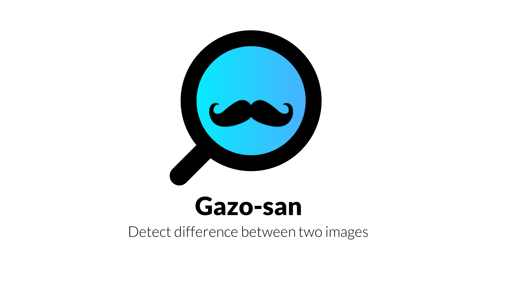
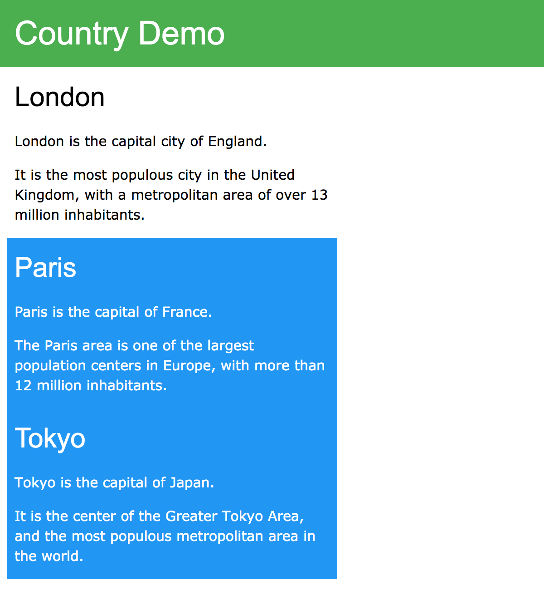
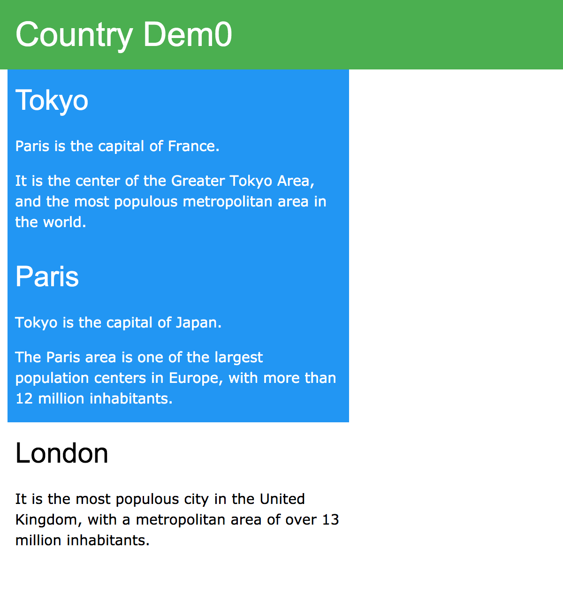

# Gazo-san


Detect difference between two images.

By separating each image into few parts, Gazo-san only detects difference on matched parts between two images. Optional shows decrease or increase part on two images.

## Quick Start
```
./gazosan tests/images/test_image_new.png tests/images/test_image_old.png output
```
| Input | Input |
| :--: | :--: |
| test_image_new.png | test_image_old.png |
|  |  |

| Output |
| :--: |
| output_diff.png |
|  |


### With option --create-change-image
```
./gazosan tests/images/test_image_new.png tests/images/test_image_old.png output --create-change-image
```

| Output | Output |
| :--: | :--: |
| output_delete.png | output_add.png |
| |  |

| Output |
| :--: |
| output_diff.png |
|  |

Output file:
- output_diff.png: Show the difference on matched parts, it's created base on old image.
- output_delete.png: Show the decrease parts to new image, it's created base on old image.
- output_add.png: Show the increase parts to old image, it's created base on new image.

Each color stands for:
- Green rectangle:
  - The parts decrease to new image.
  - The parts increase to old image.
- Red rectangle: Matched parts in both image.
- Color in red : Difference in matched part.

## Built With

* [OpenCV 4.1.2](https://docs.opencv.org/4.1.2/) - Image processing
* [cxxopts](https://github.com/jarro2783/cxxopts) - For option phrase


## How to build Gazo-san
1. Download static link library file
```
wait for upload
```
2. Compile main.cpp
```
g++ -std=c++11 ./src/main.cpp -L./ -limageDiffCalc -o gazosan `pkg-config --libs opencv`
```

## Execute Gazo-san

Execute image difference calculate.

```bash
Usage: ./gazosan PATH_TO_NEW_FILE PATH_TO_OLD_FILE OUTPUT_NAME [options]

  options

  -v, --verbose              Enable verbose output message
      --create-change-image  Create increase and decrease part image
  -h, --help                 Print help
```

You will get a png file which named "OutputName_diff.png", showing the difference between new and old image.

## Tests

### Download Google Test and Build

```bash
sh .circleci/build_googletest.sh
```

### Run test

#### Unit test

```bash
g++ -std=c++11 ./tests/unit_tests/imageDiffCalc_test.cpp -o test `pkg-config --cflags --libs opencv` -Isrc -Iinclude -Itests/googletest/include -Ltests/googletest -lgtest -lgtest_main -lpthread
./test
```

#### Integration test

```bash
g++ -std=c++11 ./tests/integration_tests/imageDiffCalc_test.cpp -o test `pkg-config --libs --cflags opencv` -Isrc -Iinclude -Itests/googletest/include -Ltests/googletest -lgtest -lgtest_main -lpthread
./test
```

#### System test

```bash
g++ -std=c++11 ./tests/system_tests/imageDiffCalc_test.cpp -o test `pkg-config --libs --cflags opencv` -Isrc -Iinclude -Itests/googletest/include -Ltests/googletest -lgtest -lgtest_main -lpthread
./test
```

## License
[Apache 2.0 license](LICENSE)

## Contributors
(In alphabetical order)
* Akari Ikenoue
* [Jye Ruey](https://github.com/rueyaa332266)
* [Naoto Kishino](https://github.com/naotospace)
* [Rikiya Hikimochi](https://github.com/hikimochi)